# Iris classification PoC deployed using AWS Lambda and Github Actions

## What this repo contains?

This repository has the code to train, save and test a simple ML model on the Iris Dataset. 
The Iris dataset is a small dataset which contains attributes of the flower - Sepal length, Sepal width, Petal length and Petal width.
The goal of the task is to classify based on these dimensions, the type of the Iris, which in the dataset is among three classes - Setosa, Versicolour and Virginica.

I also detail the steps required to package the model, push to Amazon ECR, deploy the model on AWS Lambda, expose the model using the Amazon API Gateway and finally automate the entire process using Github Actions.
The repository also contains the code to run a Streamlit app with the model deployed on AWS.

## Package Requirements
* An Amazon Web Services account (I intentionally use a simple ML model to deploy as it remains in the AWS Free tier constraints across all the services I mention above. Larger models will require more storage and hence could be chargeable.)
* Python 3.6+
* A simple 
`pip install -r requirements.txt` from the [iris_classification](iris_classification) directory will install the other Python packages required.


## Steps to follow
In this PoC, I will be training and deploying a simple ML model. If you follow this tutorial, deploying complex models should be fairly easy as well. (I had to scratch my head a lot though :sweat_smile:)


### 1. Training and Deploying the model locally

1. Clone this repo
```
git clone https://github.com/shreyansh26/Iris_classification-AWS-Lambda-PoC
```

2. Create a virtual environment - I use [Miniconda](https://docs.conda.io/en/latest/miniconda.html), but you can use any method (virtualenv, venv)
```
conda create -n iris_project python=3.8
conda activate iris_project
```

3. Install the required dependencies
```
pip install -r requirements.txt
```

4. Train the model
```
cd iris_classification/src
python train.py
```

3. Verify the model trained correctly using pytest
```
pytest
```

4. Activate Streamlit and run `app.py`
```
streamlit run app.py
```
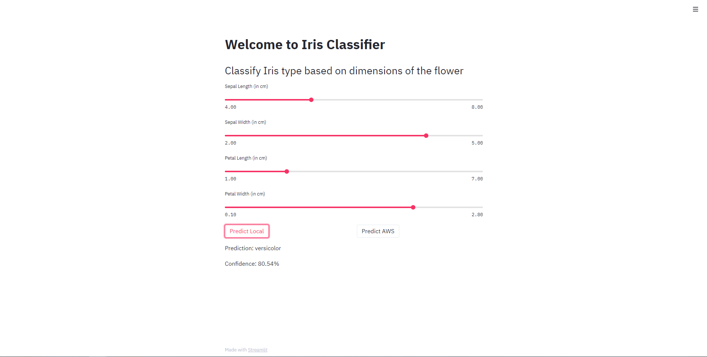

Right now, the `Predict AWS` button will give an error on clicking. It is required to set up an API of your own that the code will send the POST request to.

A `main.py` file contains the event handler which will be used by Lambda later.

### 2. Packaging the model
I have included a Dockerfile which is used to package the model. Later I will automate all this using Github Actions.

```
cd iris_classification
docker build --tag iris_classification:latest .
```

### 3. Push the Docker container to Amazon ECR
First, create a private repository. The free tier only allows for 500MB of storage in a month in a private repository.

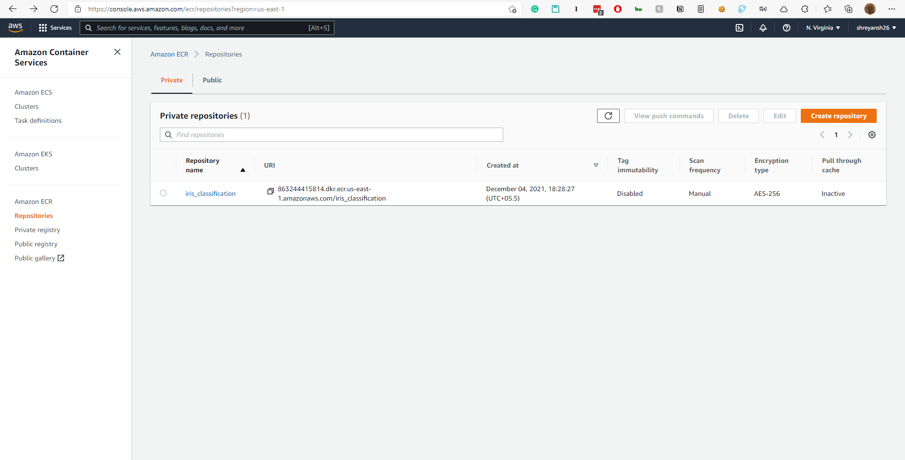

Use the following set of commands to push the local Docker container to the created repository.

```
aws ecr get-login-password --region us-east-1 | docker login --username AWS --password-stdin 863244415814.dkr.ecr.us-east-1.amazonaws.com

docker tag iris_classification:latest 863244415814.dkr.ecr.us-east-1.amazonaws.com/iris_classification:latest

docker push 863244415814.dkr.ecr.us-east-1.amazonaws.com/iris_classification:latest
```

### 4. Create a Lambda function

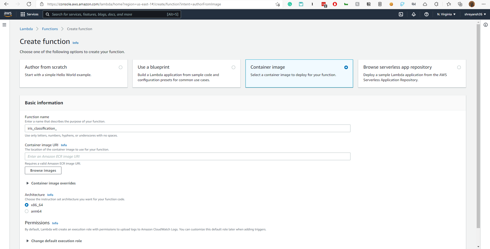

The container image URI can be selected from the AWS console itself.

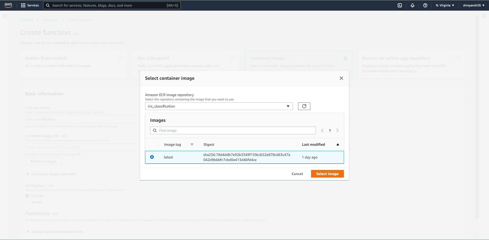

### 5. Test the Lambda

We can now test that the Lambda is correctly handling the request as we want it to. AWS allows for that. When we click on the Lambda function, it allows a Test option as well.

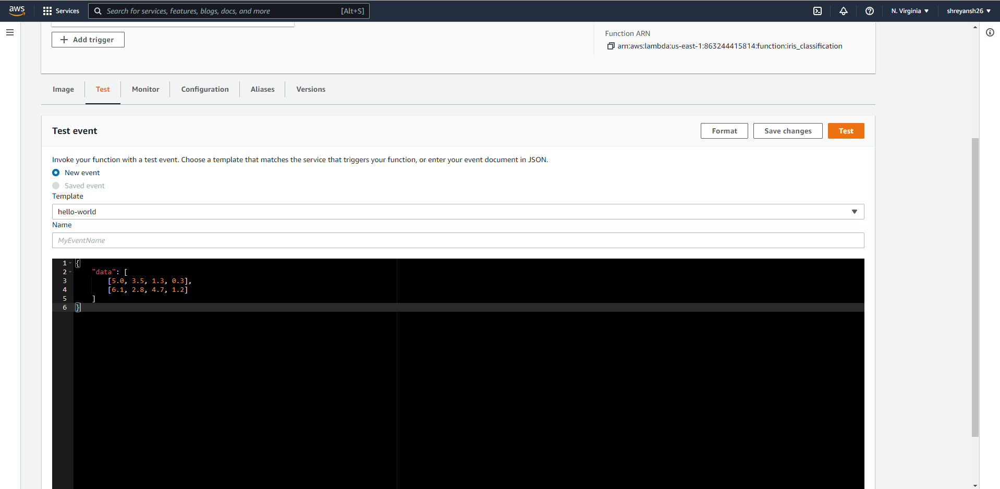

The test works and gives the correct result!!

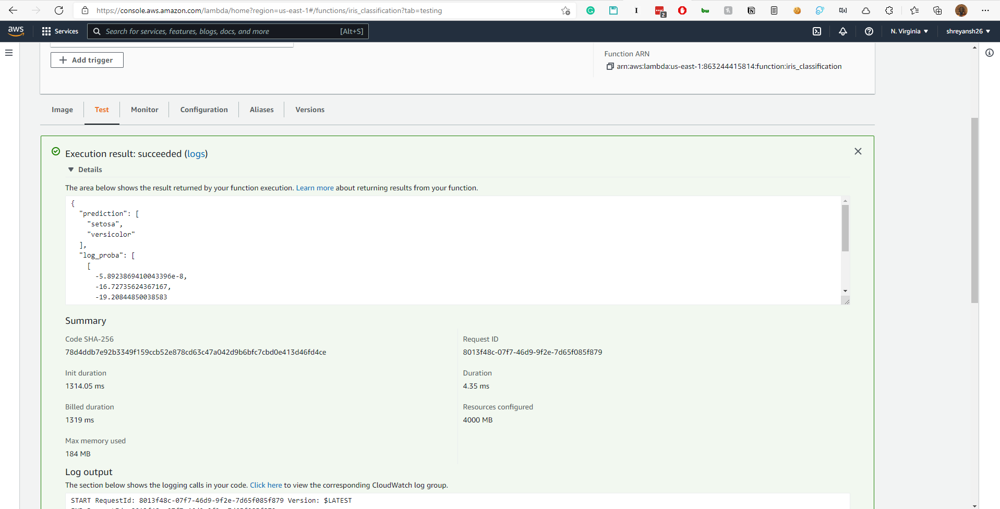

### 6. Create an API from the Amazon API Gateway

Make sure to make a REST API.

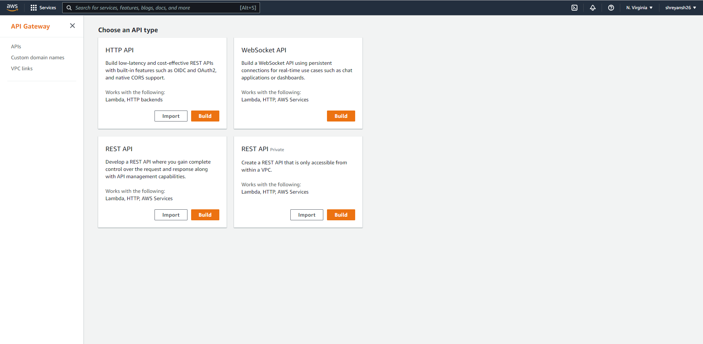

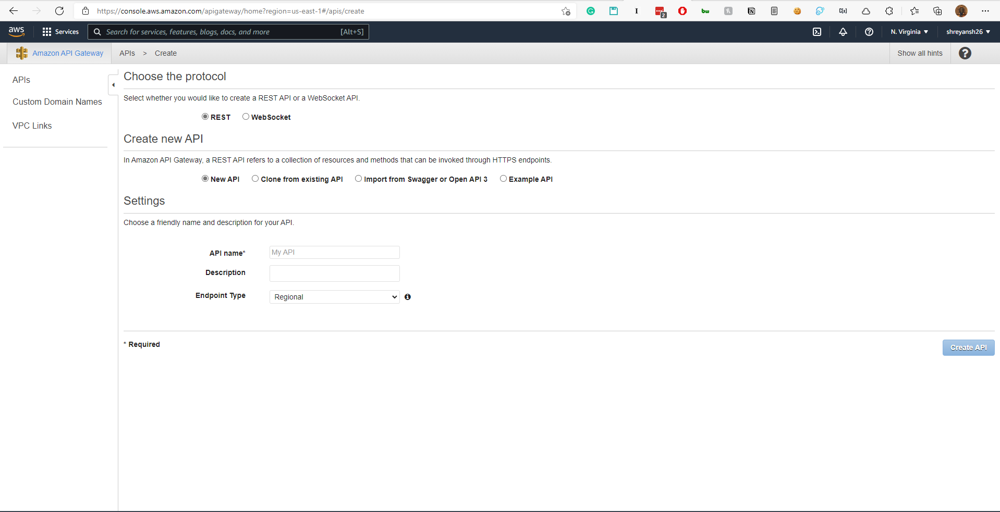

Add a `/classify` resource to the API and and add a `POST` method to the API.
Add a POST request to the API under a `/classify` resource.

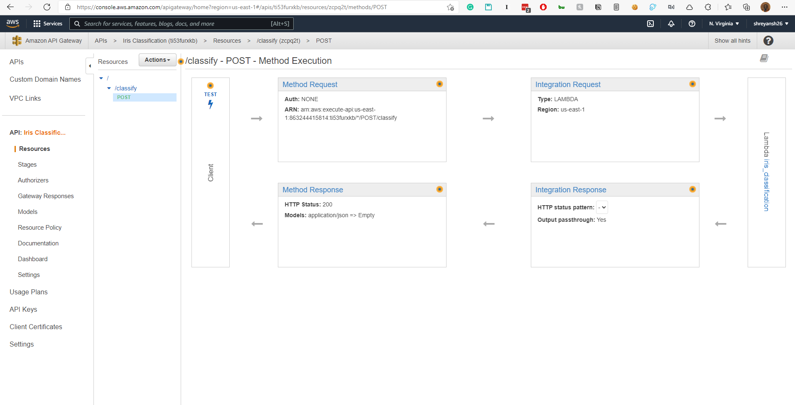

Integrate the Lambda function with the API.

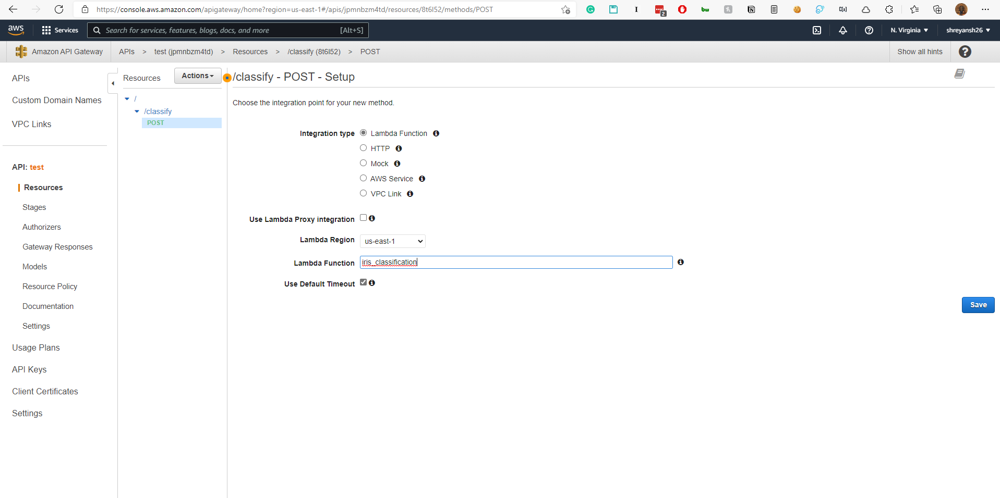

Now, if you head back to the Lambda functions page, you will see that a Trigger has been added to the function.

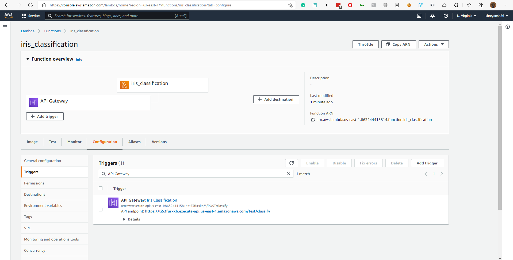

The endpoint is clearly visible in the screenshot.
It will be something like `https://{SOME_ID}.execute-api.us-east-1.amazonaws.com/test/classify`.


### 7. Test the REST API

We use a client like Postman to check the API.

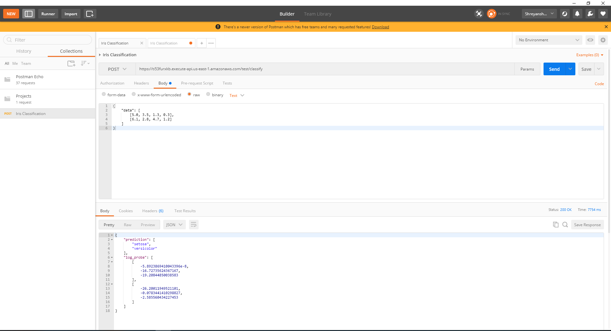

#### AND IT WORKS

Programmatically, we can also check the API that it works.

```python
import requests

url = 'https://ti53furxkb.execute-api.us-east-1.amazonaws.com/test/classify'

myobj = {
    "data": [
        [6.5, 3.0, 5.8, 2.2],
        [6.1, 2.8, 4.7, 1.2]
    ]
}

x = requests.post(url, json = myobj)

print(x.text)
```

```
{"prediction": ["virginica", "versicolor"], "log_proba": [[-35.82910355985537, -1.5907654693356144, -0.22786665344763715], [-26.20011949521101, -0.0783441410298827, -2.585560434227453]]}
```

#### THIS WORKS TOO

## Streamlit app to test the model

After making the appropriate changes to the configuration, running

```
streamlit run app.py
```

allows you to get the predictions from the AWS hosted model as well.

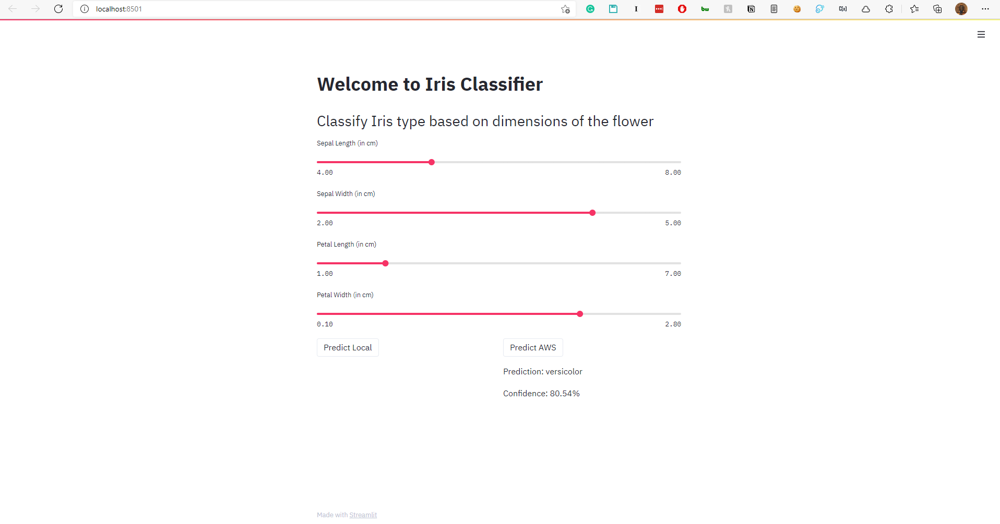


## Time to automate the whole thing using Github Actions

We use Github Actions to automate this whole process i.e. pushing the container to ECR, updating the Lambda function. The API then points to updated Lambda function automatically.

First, we will need to add the `AWS_ACCESS_KEY_ID` and `AWS_SECRET_ACCESS_KEY` to Github secrets (in the Github repo settings).

You can refer to the yml file in [.github/workflows](.github/workflows) to see how the automation works. The Github Action is triggered when a pull request is made to the `master` branch.

If required, you can also restrict any pushes to the master branch from Github ([link](https://stackoverflow.com/questions/46146491/prevent-pushing-to-master-on-github)).


### AND WE ARE DONE!